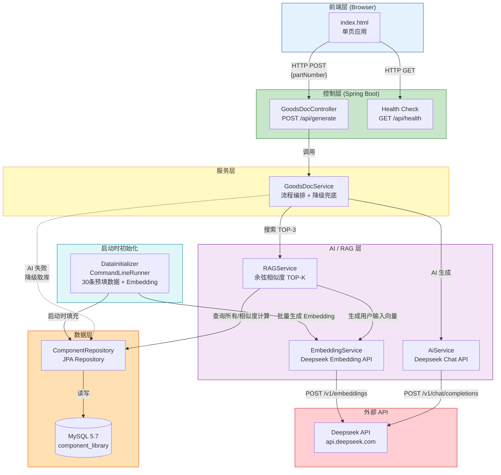
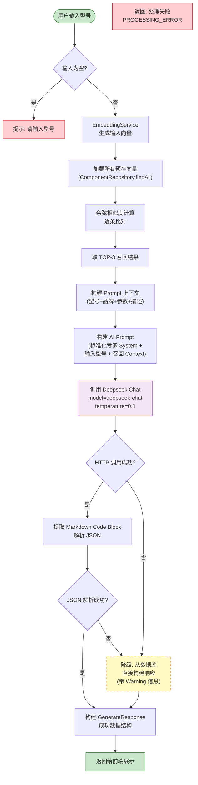
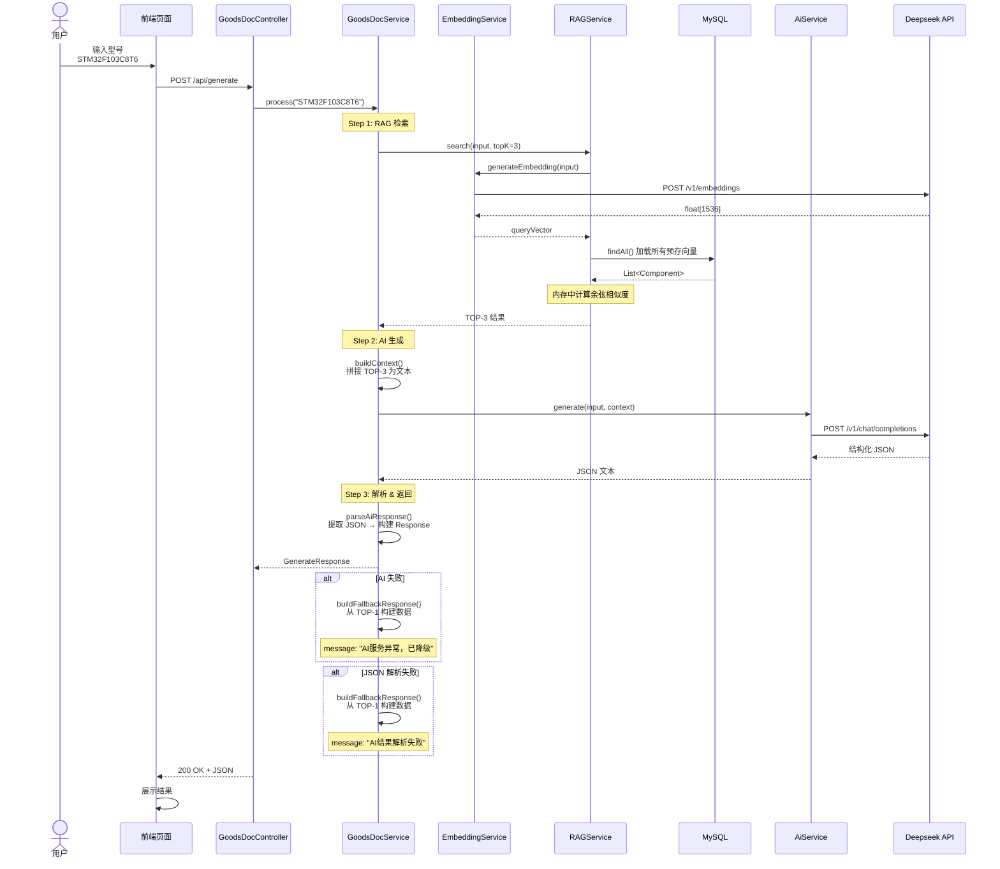
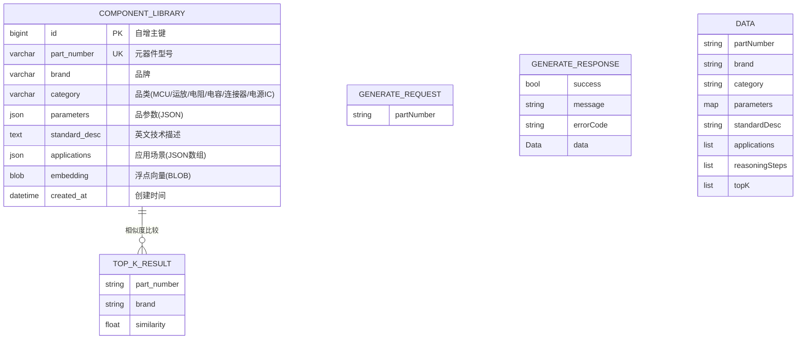
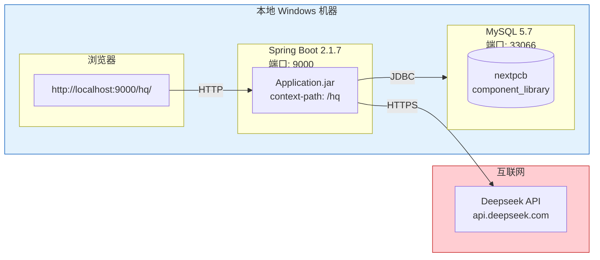
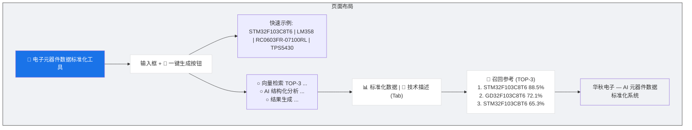

# 电子元器件数据标准化与技术描述生成系统 — 架构图与核心流程

> 用于演讲展示
> 所有图使用 Mermaid 语法，可在 Markdown 编辑器中直接渲染

---

## 一、系统架构图

---

## 二、核心流水线流程图

---

## 三、RAG 检索详情图（时序图）

---

## 四、数据模型 ER 图

---

## 五、部署架构图

---

## 六、前端页面布局图

